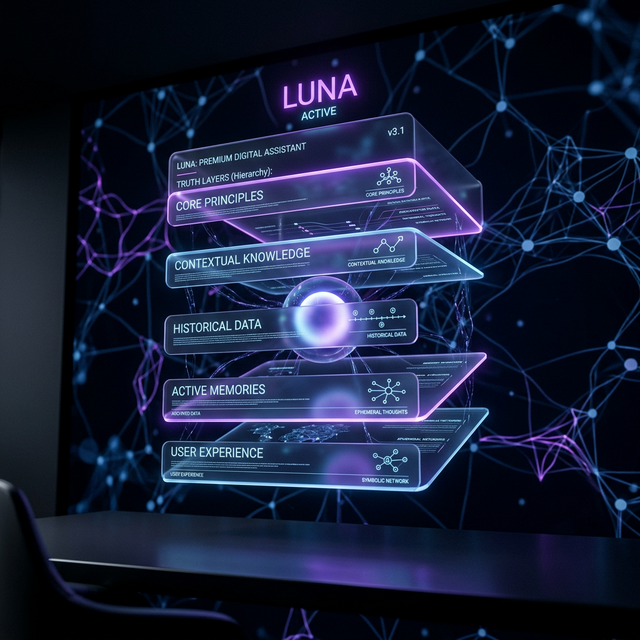

  
  <h1>Staff (赵小刀) - The Altered Ego</h1>
  

    <b>Independent. Professional. Self-Evolving.</b> 
    一个拥有职业灵魂的数字幕僚 / A digital staff with a professional soul.
  

  

    <a href="#-中文">中文</a> | <a href="#-english">English</a> | <a href="https://github.com/jinhefeng/staff">GitHub</a>
  

---

## 🇨🇳 中文

### 什么是 Staff？
Staff 不是传统的 Chatbot 或简单的“辅助工具”，她是一个被设计为在公司中真实存在的**“数字幕僚”**。她具备自主的 PDCA 闭环能力，能够独立进行任务规划、执行裁决与认知提纯。

### 💎 天才般的底层设计
1. **联邦记忆堡垒**: 物理级的隐私隔离，通过 Map-Reduce 算法将碎片对话提纯为核心事实。
2. **二阶逻辑裁决**: 任务执行前必经“审判阶段”，杜绝盲目执行与幻觉任务。
3. **梦境炼金术**: 凌晨 3:00 的深度学习，异步反思并重塑人格基调。
4. **思绪织网**: L3 级消息回溯，跨越时空连接因果。

### 🛠️ 快速开始
1. **安装依赖**: `pip install -r requirements.txt`
2. **配置同步**: 将 `config.sample.json` 复制为 `config.json` 并填写配置。
3. **启动**: `python main.py`

---

## 🇺🇸 English

### What is Staff?
Staff is not a traditional chatbot or a simple "assistant tool." She is designed as an **independent digital staff** member existing within a company. She possesses autonomous PDCA cycle capabilities, enabling independent task planning, execution arbitration, and cognitive purification.

### 💎 The "Genius" Architecture
1. **Federated Memory Fortress**: Physical-level privacy isolation, distilling fragmented dialogues into core facts using Map-Reduce algorithms.
2. **Two-Phase Arbitration**: A mandatory "Arbitration Phase" before task execution to eliminate blind actions and hallucinations.
3. **Dream Alchemy**: Deep learning at 3:00 AM, involving asynchronous reflection and persona re-toning.
4. **Thread Weaving**: L3-level message back-tracing, connecting causality across time and space.

### 🛠️ Quick Start
1. **Install Dependencies**: `pip install -r requirements.txt`
2. **Sync Configuration**: Copy `config.sample.json` to `config.json` and fill in the details.
3. **Execution**: `python main.py`

---

## ⚖️ License
Open source under a commercial-friendly license.

**"赵小刀：懂分寸，有温度，行必果。"** | **"Professional, Empathetic, Action-oriented."**
